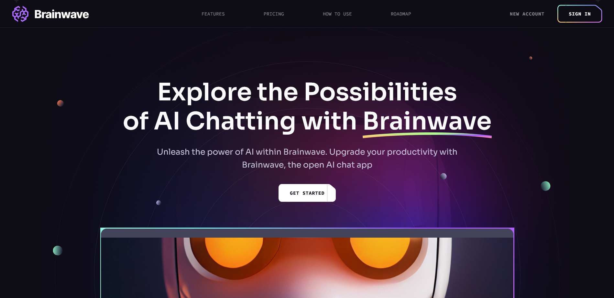
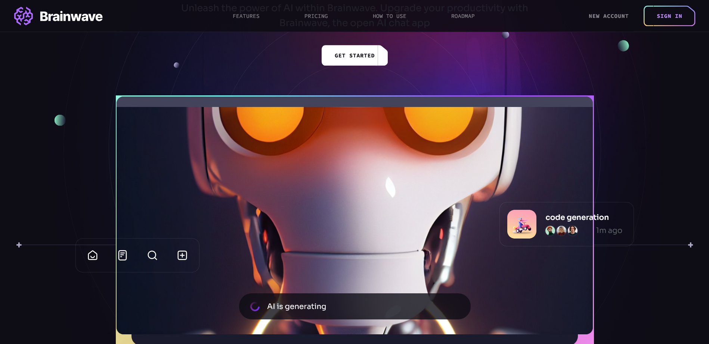

# 🧠 Brainwave – AI-Powered Portfolio Website

A modern, animated, and fully responsive front-end portfolio website built using **React**, **Tailwind CSS**, and **GSAP**. Inspired by futuristic design and smooth UI/UX interactions, Brainwave showcases front-end skills, project highlights, and professional design principles.

🔗 **Live Demo:** [brainwave-clone-tau.vercel.app](https://brainwave-clone-tau.vercel.app)

---

## 🚀 Features

- ⚡️ Smooth page transitions & scroll animations (GSAP)
- 🎨 Fully responsive design for mobile, tablet, and desktop
- 📦 Clean and modular React components
- 🎥 Hero section with interactive call-to-action
- 🔄 Optimized animations and performance
- ✨ Stylish dark UI theme

---

## 🛠 Tech Stack

- **React**
- **Tailwind CSS**
- **GSAP (GreenSock Animation Platform)**
- **Vite** (as build tool)
- **Framer Motion** (optional animations)
- **Responsive Design** (Mobile-first approach)

---

## 📸 Screenshots

### 🔹 Animated Hero Section

### 🔹 Feature Section

---

